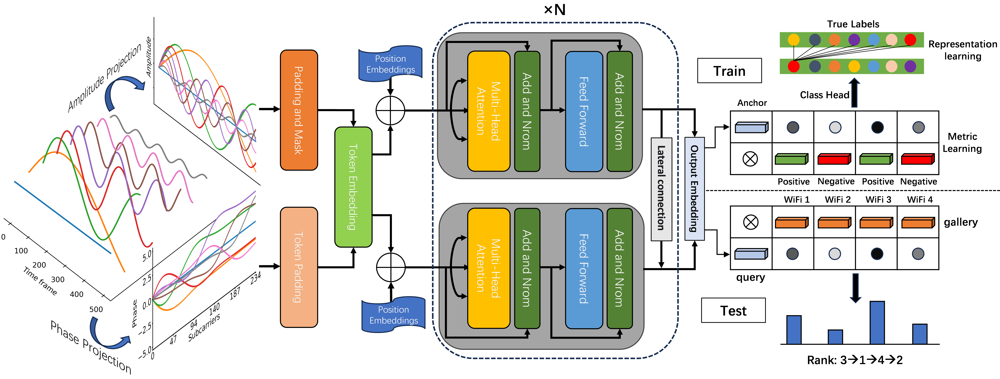
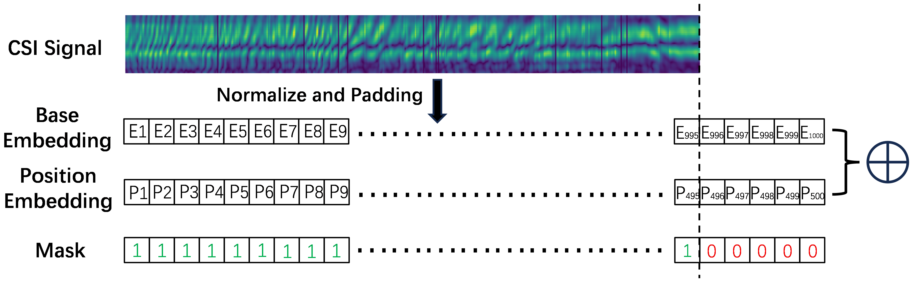

# WiFi-Person-ReID

<b>Time-Frequency Analysis of Variable-Length WiFi CSI Signals for Person Re-Identification</b>

This repository contains the official python implementation for our paper "Time-Frequency Analysis of Variable-Length WiFi CSI Signals for Person Re-Identification, Chen Mao". 
Our paper are available at [here](https://arxiv.org/abs/2406.01906).

<div align="center"></div>

## Introduction

Person re-identification (ReID), as a crucial technology in the field of security, plays an important role in security detection and people counting. Current security and monitoring systems largely rely on visual information, which may infringe on personal privacy and be susceptible to interference from pedestrian appearances and clothing in certain scenarios. Meanwhile, the widespread use of routers offers new possibilities for ReID. 

<div align="center"></div>
<div align="center"></div>

This letter introduces a method using WiFi Channel State Information (CSI), leveraging the multipath propagation characteristics of WiFi signals as a basis for distinguishing different pedestrian features. We propose a two-stream network structure capable of processing variable-length data, which analyzes the amplitude in the time domain and the phase in the frequency domain of WiFi signals, fuses time-frequency information through continuous lateral connections, and employs advanced objective functions for representation and metric learning. Tested on a dataset collected in the real world, our method achieves 93.68% mAP and 98.13% Rank-1.

## Cite
Here is the bibtex to cite our arxiv paper, the Springer version will be cited after official publication.
```
@ARTICLE{2024arXiv240601906M,
       author = {{Mao}, Chen and {Hu}, Jingqi},
        title = "{ProGEO: Generating Prompts through Image-Text Contrastive Learning for Visual Geo-localization}",
      journal = {arXiv e-prints},
     keywords = {Computer Science - Computer Vision and Pattern Recognition, Computer Science - Information Retrieval},
         year = 2024,
        month = jun,
          eid = {arXiv:2406.01906},
        pages = {arXiv:2406.01906},
          doi = {10.48550/arXiv.2406.01906},
archivePrefix = {arXiv},
       eprint = {2406.01906},
 primaryClass = {cs.CV},
       adsurl = {https://ui.adsabs.harvard.edu/abs/2024arXiv240601906M},
      adsnote = {Provided by the SAO/NASA Astrophysics Data System}
}
```

Parts of this repo are inspired by [fast-reid](https://github.com/JDAI-CV/fast-reid).
